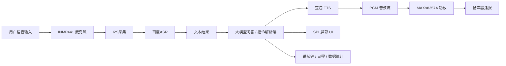
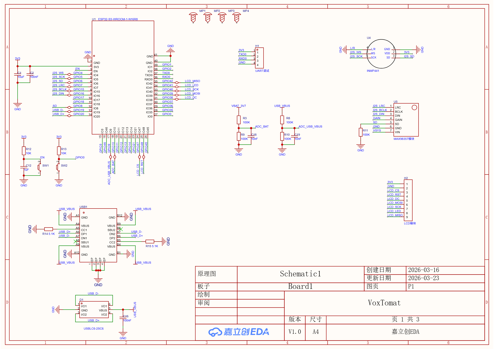
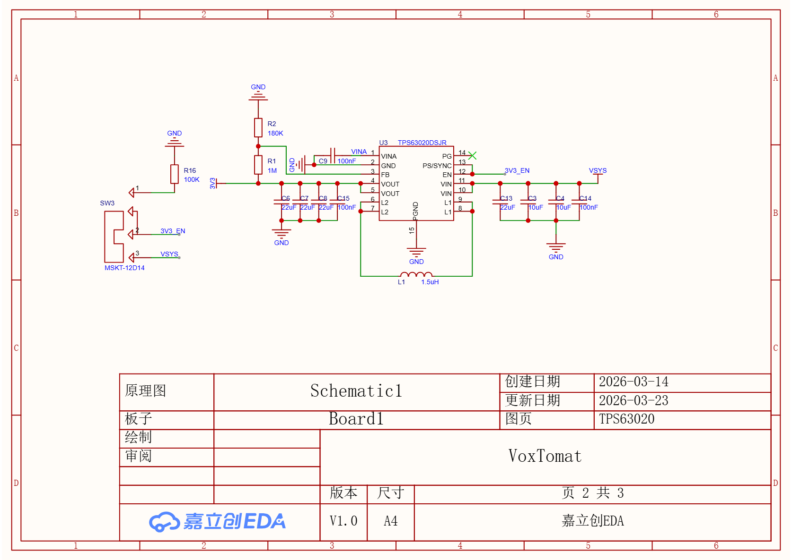
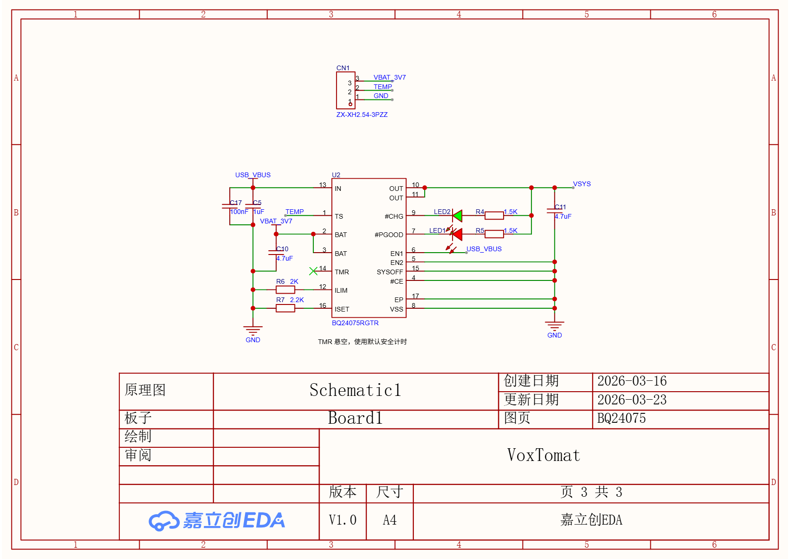
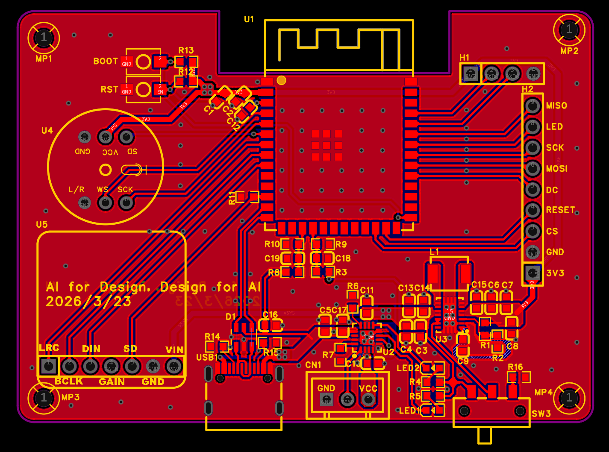
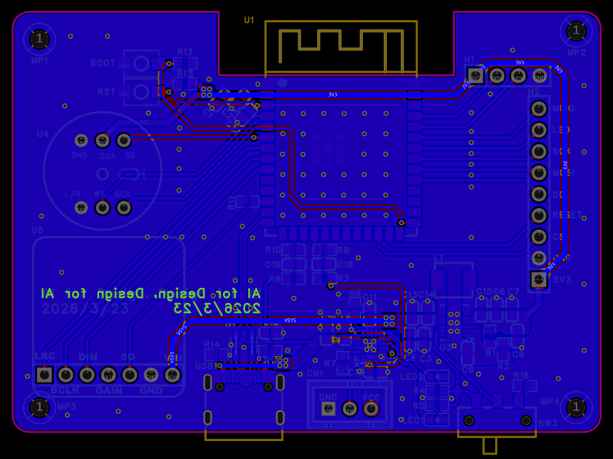
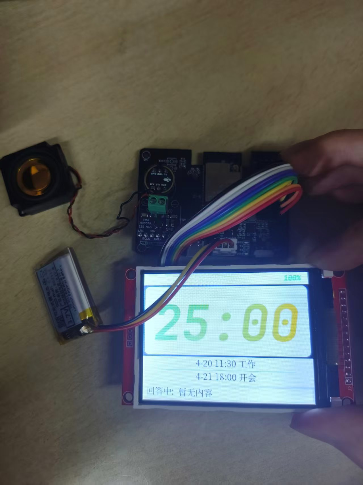

# VoxTomat-基于 ESP32-S3 的 AI 语音学习终端（ESP32-S3 AI Voice Study Companion）

> 设备形态：桌面式 AI 学习终端 / 智能番茄钟

## 项目文档

- [更新日志（ChangeLog）](./ChangeLog.md)

## 项目概述

本项目是一款面向学习场景的桌面式 AI 语音终端，围绕“专注管理 + 智能答疑 + 学习提醒”展开设计。系统以 `ESP32-S3` 为主控，完成了从硬件选型、原理图与 PCB 设计、焊接调试，到嵌入式软件框架搭建、音频链路打通、云端语音服务接入、整机联调与结构外壳制作的完整开发流程。

项目目标是在低功耗边缘硬件上构建一套可落地的智能学习助手能力，支持语音采集、语音识别、文本理解、语音播报，以及学习场景下的番茄钟、日程提醒和数据统计等扩展功能。

补充说明：本仓库当前主要包含底层音频链路、Wi-Fi 联网、百度 ASR、豆包 TTS 等核心软件模块；番茄钟 UI、日程管理、屏幕交互、DeepSeek 对话编排、ESP-SR/VAD 等能力将作为后续迭代方向持续完善。

## 核心亮点

- 独立完成硬件与软件的全链路开发，包括原理图、PCB、焊接调试、嵌入式软件与整机联调。
- 基于 `FreeRTOS` 任务和队列构建音频处理链路，实现录音、识别、合成、播报的模块化解耦。
- 使用 `I2S` 驱动 `INMP441` 麦克风与 `MAX98357A` 功放，完成 16 kHz 语音采集与播放闭环。
- 接入云端语音服务，实现“语音输入 -> 识别 -> 文本处理/指令路由 -> 语音播报”的交互基础能力。
- 面向学习终端场景设计可扩展的业务方向，包括番茄钟专注管理、日程提醒、学习统计与智能问答。
- 项目具备较强可迁移性，核心软件模块可复用到通用 `ESP32-S3` 开发板。

## 目标功能设计

### 已完成/已验证

- `Wi-Fi` 入网与联网状态管理
- `INMP441` 麦克风语音采集
- 百度语音识别 `ASR`
- 豆包语音合成模型 2.0 `TTS`
- `MAX98357A` 扬声器音频播放
- 基于 `FreeRTOS Queue` 的语音处理任务链路
- 接入 `DeepSeek` 大模型，支持基础问答能力
- 部署 `ESP-SR`，实现唤醒词检测、`VAD` 与本地前处理
- 基于 `SPI` 显示屏移植 `LVGL` 实现番茄钟、学习日程UI界面

### 规划与可扩展功能

- 优化提示词与业务逻辑，使 `LLM` 端具备指令解析能力
- 增强 `LVGL` 模块与系统交互能力
- 增加 Web 端管理与数据同步能力
- 增加学习数据记录、专注时长统计与提醒逻辑
- 完成 3D 外壳设计与整机装配优化

## 主控与外设

- 主控：`ESP32-S3 N16R8`
- 音频输出：`MAX98357A`
- 音频输入：`INMP441`
- 显示：`3.2 寸 SPI 显示屏`
- 电池充电：`BQ24075`
- 电源变换：`TPS63020 (2.5-5.5V宽压输入转3.3V，适配锂电池2.8V-4.2V全电压范围)`
- 供电：`3.7V 聚合物锂电池（带 NTC）`

## 硬件技术栈

- `原理图设计 / PCB Layout`
- `ESP32-S3` 最小系统与外围电路设计
- `I2S` 音频接口硬件设计与调试
- `SPI` 显示接口与外设连接设计
- 锂电池供电、充电管理与 `3.3V` 电源设计
- `Wi-Fi` 天线净空、分区布线与基础抗干扰处理
- `EMC / ESD` 基础防护设计
- PCB 焊接、上电排查与硬件联调

## 软件技术栈

- `ESP-IDF`
- `FreeRTOS`
- `C / CMake`
- `Wi-Fi`
- `I2S`
- `HTTP / HTTPS`
- `cJSON`
- 音频采集、PCM 数据处理与播放
- 云端 `ASR / TTS API` 接入
- `SSE` 流式数据解析

## 当前代码架构

本仓库当前的软件架构如下：

```text
VoxTomat
├── main
│   └── main.c                           # 应用入口；系统初始化；任务创建；语音/界面流程编排
├── components
│   ├── BSP
│   │   ├── I2S
│   │   │   ├── i2s.c                    # 麦克风/扬声器 I2S 驱动封装
│   │   │   └── i2s.h
│   │   ├── SPI
│   │   │   ├── spi.c                    # SPI 总线初始化
│   │   │   └── spi.h
│   │   ├── LCD
│   │   │   ├── lcd.c                    # LCD 面板初始化
│   │   │   └── lcd.h
│   │   ├── LV_DRIVER
│   │   │   ├── lvgl_port.c              # LVGL 任务与端口初始化
│   │   │   ├── lvgl_port.h
│   │   │   ├── lv_port_disp.c           # LVGL 显示驱动绑定
│   │   │   └── lv_port_disp.h
│   │   └── UI
│   │       ├── app.c                    # UI 异步更新封装；番茄钟/时间/日程/对话区接口
│   │       ├── app.h
│   │       ├── voxtomat.c               # 主界面组件创建与显示刷新
│   │       ├── voxtomat.h
│   │       ├── gradient_text.c          # 渐变倒计时文本组件
│   │       ├── gradient_text.h
│   │       └── *.c                      # 字体资源
│   └── Middlewares
│       ├── WIFI
│       │   ├── wifi.c                   # STA 初始化、连接、事件处理
│       │   └── wifi.h
│       ├── DATE
│       │   ├── date.c                   # 网络时间获取、本地时间基准维护与推算
│       │   └── date.h
│       ├── SCHEDULE
│       │   ├── schedule.c               # 日程增删、排序、复制
│       │   └── schedule.h
│       ├── ASR
│       │   ├── asr.c                    # 百度 ASR token 获取与语音识别
│       │   └── asr.h
│       ├── TTS
│       │   ├── tts.c                    # 豆包 TTS 流式解析、解码、播放
│       │   └── tts.h
│       ├── LLM
│       │   ├── llm.c                    # DeepSeek 请求构建、JSON 解析、指令分发
│       │   └── llm.h
│       ├── SR
│       │   ├── sr_engine.c              # ESP-SR feed/fetch 任务与事件流转
│       │   ├── sr_engine.h
│       │   ├── sr_model.c               # 唤醒词/VAD/AFE 模型初始化
│       │   ├── sr_model.h
│       │   ├── sr_session.c             # 单次语音会话缓存管理
│       │   ├── sr_session.h
│       │   └── sr_event.h               # SR 事件定义
│       ├── project_secrets.h            # 本地私有配置（已忽略）
│       └── project_secrets.h.example
├── CMakeLists.txt
├── dependencies.lock
└── partitions-16MiB.csv
```

## 系统架构设计



## 开发流程

### 1. 需求定义与方案拆解（已完成）

- 明确产品定位：服务于学习场景的 AI 语音交互终端
- 拆分核心能力：供电、联网、采音、放音、显示、模型接入、交互逻辑
- 评估自研 PCB 与开发板验证两种落地路径，优先保证功能闭环

### 2. 元器件选型与原理图设计（已完成）

- 选定 `ESP32-S3 N16R8` 作为主控，兼顾算力、RAM 与无线能力
- 选用 `INMP441 + MAX98357A` 实现数字音频输入输出
- 引入 `BQ24075` 完成锂电池充电管理，`TPS63020` 提供稳定 3.3V 电源
- 预留 `SPI` 显示、人机交互与结构安装接口

### 3. PCB Layout 与硬件调试（已完成）

- 完成原理图绘制与 PCB 布线
- 关注电源完整性、I2S/SPI 走线、射频区域与模拟地噪声
- 完成打板、焊接、上电检查、关键电源轨与时钟信号调试

### 4. 软件框架搭建（已完成）

- 采用 `ESP-IDF + FreeRTOS` 搭建分层结构
- 将底层驱动、联网、语音服务拆分为独立组件
- 使用队列连接录音、识别、播报任务，降低模块耦合

### 5. 音频链路打通（已完成）

- 初始化 `I2S` 麦克风采集通道与功放输出通道
- 处理 `INMP441` 的 32-bit stereo 采样转 16-bit mono 数据
- 验证音频采集幅值、播放音量与端到端链路稳定性

### 6. 云端语音服务接入（已完成）

- 接入百度 `ASR` 获取识别文本
- 接入豆包语音合成模型 2.0，实现文本转语音播报
- 预留大模型文本理解层，用于问答、日程操作与控制类指令解析

### 7. 智能交互与业务能力扩展（开发中）

- 接入 `DeepSeek` 完成自然语言对话与命令分类 （已完成）
- 部署 `ESP-SR` 与 `VAD`，减少无效上传、优化交互体验 （已完成）
- 扩展 `SPI` 屏幕界面，移植 `LVGL` ，实现UI界面 （已完成）
- 完成 `LVGL` 与系统的交互，实现番茄钟、日程与学习状态展示

### 8. 项目优化与整机收尾（开发中）

- 增加 Web 端管理页面，提升配置与数据查看效率
- 优化语音链路时延、音量、错误重试与网络异常处理
- 完成结构外壳设计与 3D 打印装配
- 形成可展示的整机 Demo、项目文档与答辩材料

## 硬件设计与实物展示

### 原理图




### PCB 设计



### 实物展示


## 仓库使用说明

### 1. 特殊说明

移植 LVGL 模块后，系统运行压力上升，使用 JTAG 方式烧录时可能会与 OpenOCD 的运行冲突导致烧录失败，推荐使用 UART 方式烧录

### 2. 本地私有配置

首次拉取仓库后，请先复制：

```text
components/Middlewares/project_secrets.h.example
```

为：

```text
components/Middlewares/project_secrets.h
```

然后填写本地 `Wi-Fi / 百度 ASR / 豆包 TTS` 配置。

### 3. 编译环境

- `ESP-IDF`
- 目标芯片：`esp32s3`

### 4. 编译与烧录

```bash
idf.py set-target esp32s3
idf.py build
idf.py -p <PORT> flash monitor
```
